Interactive Flame Graph overview
=========

Flame graph could be generated with sjk using `sjk flame -f FILE -o report.html` command.

Result would be a self contained html file.

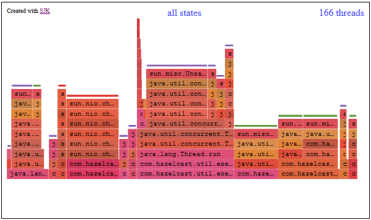

[Here](https://training.ragozin.info/collaterial/flame_demo.html) you can play with pregenerated flame graph.

Visuals are generated dynamically using JavaScript so you may see placeholder screen 
for few seconds after opening a file.

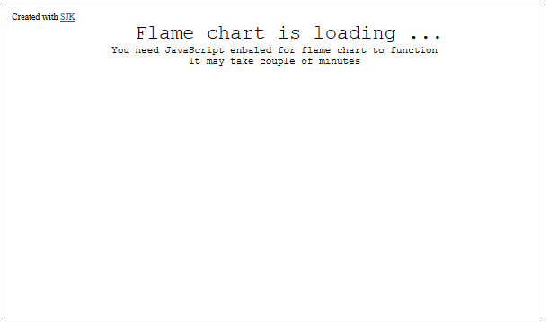

Once visuals are generated, you should see a flame graph in all its colors. 
Graph would scale to width of your browser automatically, but vertical axis may require scrolling.

While hovering mouse over nodes in the graph you would see a tooltip with description on node.

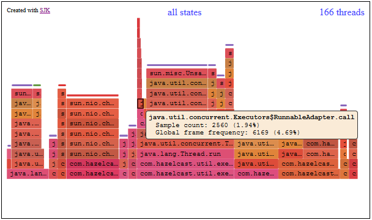

Filtering samples
---------

On top of view you should see thread filter and state filter. State filter will not show up is thread state data is not available.

Clicking on thread filter link will popup filter panel. 

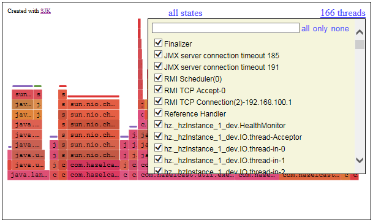

Search box could be used to filter displayed thread list. 

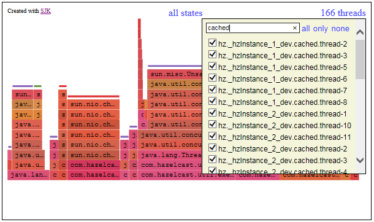

Threads could be selected/deselected individually or by bulk operations (links right to search box).

 - `all` selects all visible threads
 - `only` selects all visible and deselects all invisible
 - `none` deselects all visible

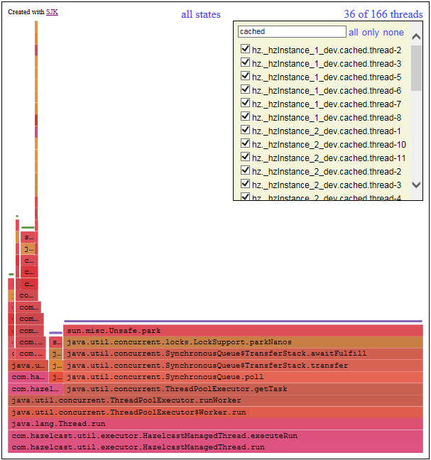

Flame chart is content is updating based on thread filter.

State filter works similar way. State filter popup also displays number of samples for each state matching active thread filter.

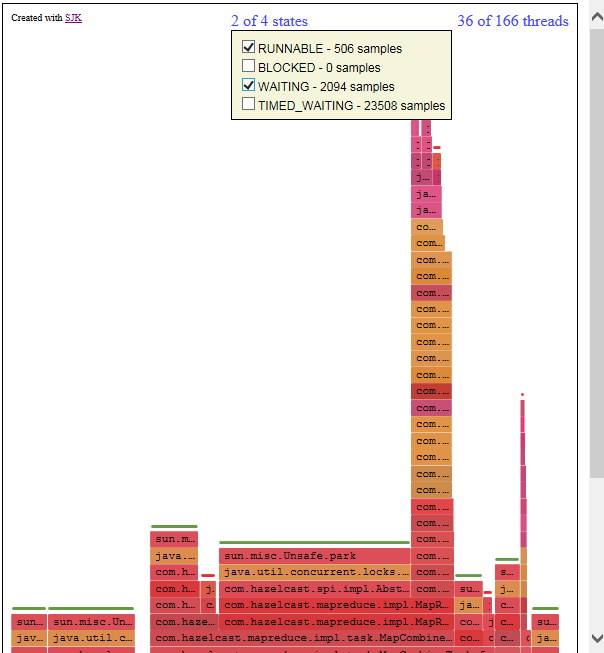

Flame graph is being rebuild for each filter change. This may cause page to be unresponsive for few seconds.

Zooming graph
----------

For zooming flame graph, click once on node you want to zoom. After first click info tooltip would disappear and node would remain highlighted, other nodes for same frame would also get highlighted. 

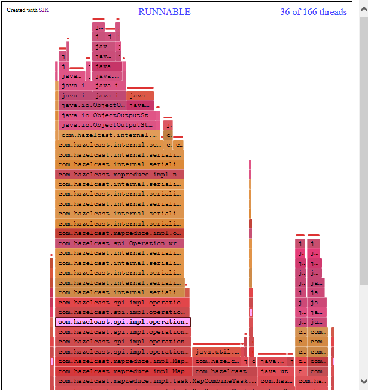

Click second time and node context popup will show up. Node context popup contains full trace for selected node. There are also zoom links at bottom.

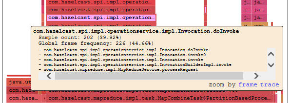

There are two types of zoom.

If you, would select "frame" mode. All traces collected selected frame would be collected 
and flame graph would should a picture of subtraces rooted from zoomed frame.

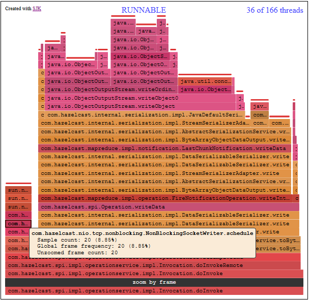

In "trace" mode zoom graph would show flame graph rooted at selected node.

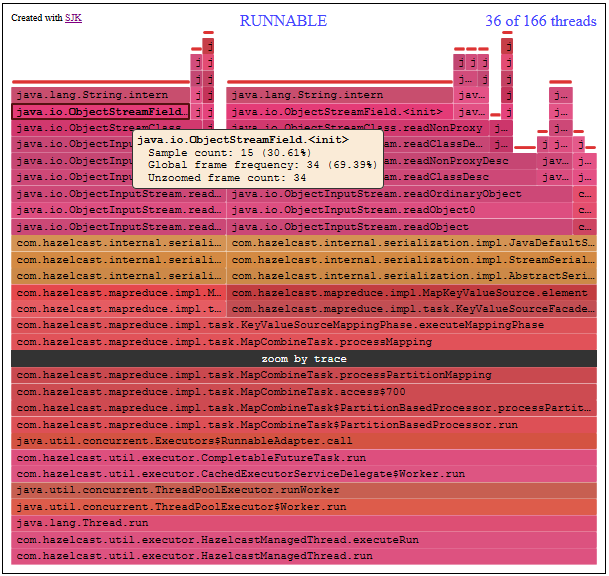

Black bar indicates zoom mode of graph. Click to black bar to unzoom view.

